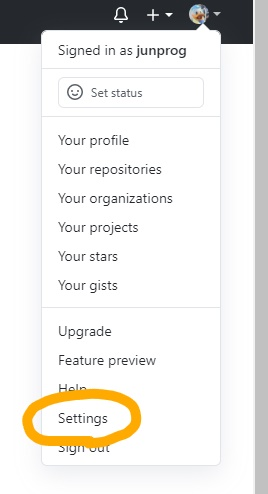
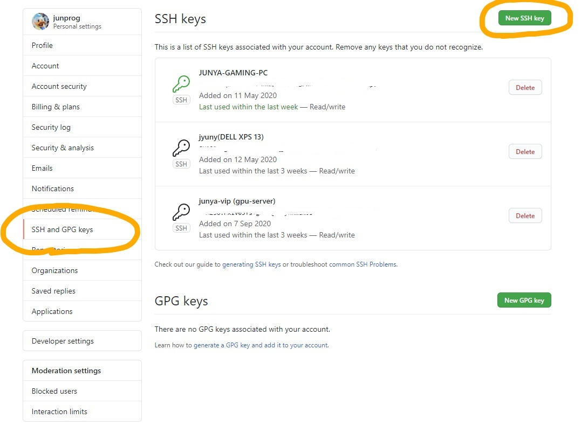
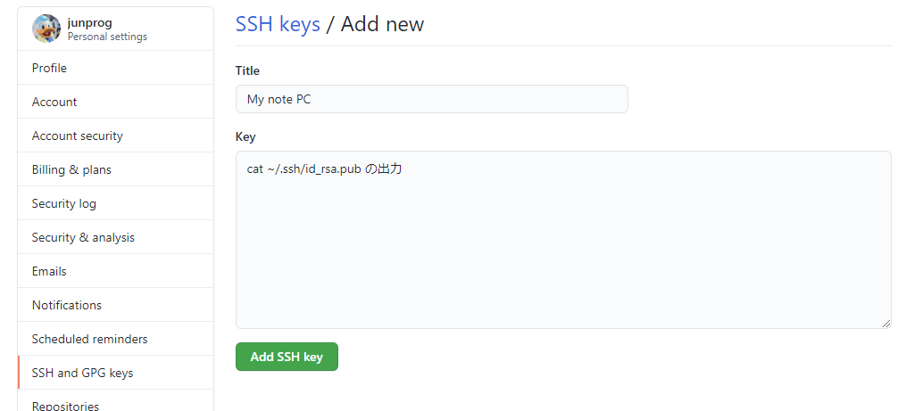

現在のWebサーバーの構成と開発のための環境構築
===
Webサイト：[VIP_Web](http://www.vip.is.ritsumei.ac.jp/index.html "VIP_web") の構成と開発のための環境構築を説明します！
少しとっかかりにくいかもしれませんが、頑張ってください m(_ _)m

<br>

## 1. 構成

現在のWebページを構成している主な要素の概要です。ここは、「ふーん、そういうものなのか」程度の認識で大丈夫です。

### 1.1 Apache
* Apache(あぱっち)とは、WebサーバーソフトウェアのことでHTTPというプロトコルで動いてます。これがあるおかげで、サーバーにあるhtmlなどのファイルをみんなのブラウザから見ることが出来てます。

* Apacheの設定はもうすでに終わってるので、問題が起きない限り触らなくて大丈夫です。


### 1.2 git
* git(ぎっと)とは、Webの開発関係なく、様々なプロジェクトの開発や進捗管理を行うのに便利なソフトです。現在はこちらのgitを使用して、Webページの修正や変更を行ったあと、コミットして本番環境(実際のWebサイトに反映してるコード)にプッシュしています！


### 1.3 GitHub
* GitHub(ぎっとはぶ)とはgitで管理されたプロジェクトをオンラインでみんなで共有できるWebサービスです。このサービスの良いところはWeb上で色々できるので、今のリモートでの作業にうってつけなのです。

* しかしながら今のところはWebサーバーとは直接的な関わりが無いので、Web上のコード保管庫みたいな状態になってます...笑 

* GitHubのリポジトリ：[https://github.com/VIP-Labo/vip-hp](https://github.com/VIP-Labo/vip-hp)

### 1.4 Webサーバーのhtml等のデータファイル
* 研究室の端っこにあるデスクトップPCがサーバーになります。現在はWebサーバーとファイルサーバーの2つの役割を担っていますが、今回はWebサーバーに関して説明します。

* Cent OS 8.2 で動いてます。そしてWebサーバーが反映されているファイルがあるディレクトリは `/var/www/html/vip_web` となっています。

### 1.5 VIP Cloud (owncloud)
* [VIP Cloud](http://www.vip.is.ritsumei.ac.jp/owncloud/index.php/login) こちらはOSSのサービスである[owncloud](https://owncloud.com/)をオンプレミスで利用させて頂いてます。

* 具体的には apache + php-fpm + mariaDB + owncloud という構成で稼働しています。

* Webページにぶち込んだ[uchida](https://github.com/junprog)自身も深い理解はしてないので、いじる際はご注意ください。。。

### 1.6 概略図
 
<br>

## 2. 開発のための環境構築
現在コロナのため、大学に来なくてもお家で開発ができるように git そして GitHub を使って開発していこうと思います！それでは以下の手順に従ってください！わからなくなったら、研Slackの #ホームページ管理係 までおねがいします。

開発する際はエディタとして[Visual Studio Code](https://code.visualstudio.com/ "Visual Studio Code")を強くおすすめしています。


### 2.1 gitをPCに導入しよう

導入のチュートリアルはこちらのサイト：[https://eng-entrance.com/git-install](https://eng-entrance.com/git-install) を参考にして頂ければと思います。

* Windowsユーザーの方はこちらのサイト：[Get git](https://gitforwindows.org/) よりダウンロードおよびインストールをお願いします。

* Macユーザーは確かデフォルトで入ってるので、上記のサイトのユーザー名とメールアドレスの登録だけお願いします。


### 2.2 GitHubアカウントを作ろう
* [https://github.com/](https://github.com/) このサイトに飛んでアカウントを作成してください。

* アカウントを作成しましたら、アカウント名を研Slackの #ホームページ管理係 や僕の個人DMに教えてください。

* そうしたら、[vip-hp リポジトリ](https://github.com/VIP-Labo/vip-hp) に招待しますので、GitHubに関連付けてあるメールアドレスに届く招待メールで承認してください。

### 2.3 GitHubにssh keyを登録しよう
こちらの[参考サイト](https://qiita.com/0ta2/items/25c27d447378b13a1ac3)をもとに、ssh keyを生成して自分のGitHubアカウントにssh接続できるようにしていきます。

#### 2.3.1 クライアント(各ノートPC等)で公開鍵、秘密鍵を作成（作ってある人はとばしてください）

* `-C` のコメント部分を任意のメールアドレスに入れ替えて、以下のコマンドを実行
```bash
$ ssh-keygen -t rsa -b 4096 -C "your_email@example.com"
``` 
* SSH鍵の保存先を聞かれるので、特に指定が無い場合は Press Enter
```bash
Enter file in which to save the key (/Users/you/.ssh/id_rsa): [Press enter]
```
* パスフレーズを聞かれるので、各自のパスワードを設定
```bash
Enter passphrase (empty for no passphrase): [Type a passphrase]
# Enter same passphrase again: [Type passphrase again]
```
* 鍵が作成できたら以下のコマンドで作成できているかどうか確認
```bash
# Mac, Linux
$ ls -al ~/.ssh

# Win
> cd ~
> dir .ssh
```

#### 2.3.2 作成した公開鍵をGitHubのSSH keyに登録

* GitHubにログインして、右上アイコンの ▼ からSettingsに移動

 

* SSH and GPG Keys を選択し、New SSH key を選択

 

* Titleは適当にMy note PCとか分かりやすい名前で設定、Key部分に公開鍵の中身をコピペ

 

公開鍵の中身は以下のコマンドで出力して、手動でコピペでOKです。
```bash
$ cat .ssh/id_rsa.pub
```

* あとはAdd SSH keyで登録完了です。

#### 2.3.3 エイリアス設定 (しなくていいかも)

~/.ssh/configを作成および設定することで git@github.com の部分を省略して任意の名前に変更 (以下の例は"github"に設定。これは鍵認証と直接関係ないが、やっておくと便利。)

* ~/.ssh下にconfigファイルを以下の内容で作成、保存 (一応ファイル添付しておきます 。 ~/.sshに置いてください。)
```
Host github
  HostName github.com
  User git
  IdentityFile ~/.ssh/id_rsa
```
* パーミッションを変更
```bash
# Mac, Linux
$ chmod 600 ~/.ssh/config

# Win
すみませんわかりません。僕は git bash で上記のchmodを実行しました。
```

#### 2.3.4 鍵認証方式で試しに接続
```bash
$ ssh github
Enter passphrase for key 'C:\Users\Junya/.ssh/id_rsa': # passphraseを入力
PTY allocation request failed on channel 0
Hi junprog! You ve successfully authenticated, but GitHub does not provide shell access.
Connection to github.com closed.

## 成功！！ ##
```

### 2.4 GitHub上のWebサイトのリポジトリをクローンしよう

* 以下のコマンドを実行してください。
```bash
$ cd # ファイルを持ってきたいディレクトリに移動

$ git clone git@github.com:VIP-Labo/vip-hp.git
Cloning into 'vip-hp'...
Enter passphrase for key '/c/Users/Junya/.ssh/id_rsa': # passphraseを入力
remote: Enumerating objects: 253, done.
remote: Counting objects: 100% (253/253), done.
remote: Compressing objects: 100% (197/197), done.
remote: Total 253 (delta 96), reused 200 (delta 52), pack-reused 0R
Receiving objects: 100% (253/253), 9.76 MiB | 893.00 KiB/s, done.
Resolving deltas: 100% (96/96), done.

```

これで導入はおわりです！あとはみなさんとzoomなどを通して、インタラクティブに開発のチュートリアルをしていこうと思います。

それと、上記の導入がわけわからんくても大丈夫です！その時はむやみに何もせず、zoomするときに一緒にやっていきましょう。

作成 : [uchida](https://github.com/junprog)